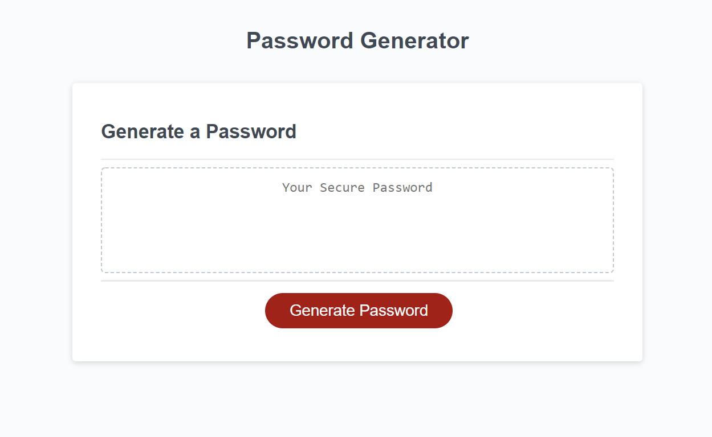

# Password Generator
I was tasked with updating the js file for the web app to generate a password when the button was pressed.  I made a function for getting the password length and character options so the functions could rerun if the wrong input was entered.  I then made an array of the possible characters and appended them to a password bank array based on the options selected.  Finally the password was generated by randomly selecting a character from the password bank and repeating until it reached the password length selected.

## Link
You can see the password generator [here](https://bthalpin.github.io/Password-Generator/).

## Media 
This following image shows the main page of the password generator:
